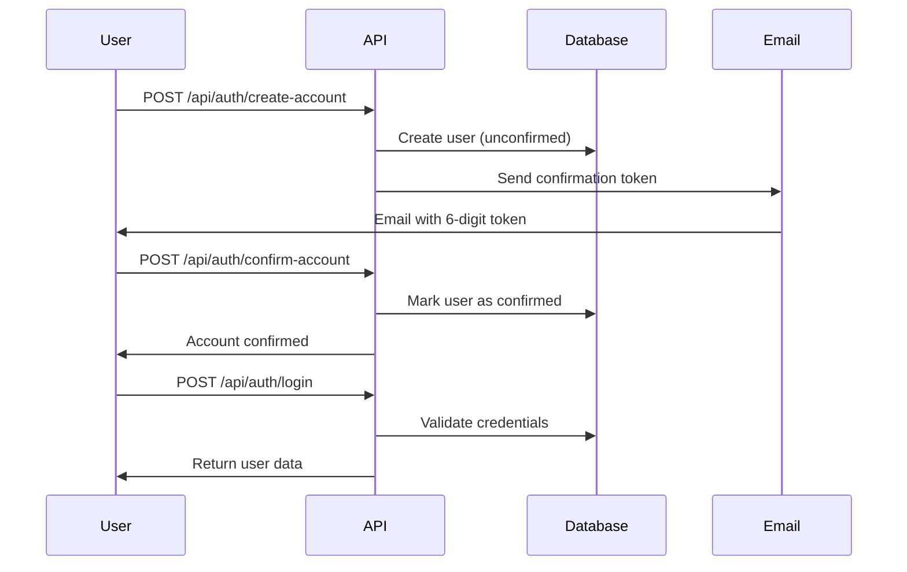

## Overview

Cognit Backend implements a comprehensive authentication system using **JWT (JSON Web Tokens)**, **bcrypt password hashing**, and **email-based verification**. The system handles user registration, login, email confirmation, and password reset flows.

## Authentication Flow



## User Registration

### Create Account Endpoint

```typescript src/controllers/AuthController.ts
static createAccount = async (req: Request, res: Response) => {
    const {email, password } = req.body

    const userExists = await User.findOne({ where: {email}})
    if(userExists) {
        const error = new Error("There is a problem creating user")
        res.status(409).json({error: error.message})
        return
    }

    try {
        const user = new User(req.body)
        user.password = await hashPassword(password)
        user.token = generateToken()

        await user.save()

        await AuthEmail.sendConfirmationEmail({
             username: user.username,
             email: user.email,
             token: user.token,
        })
        res.status(201).json("User created successfully")
    } catch (error) {
        res.status(500).json({error: "Error creating user"})
    }
}
```

<Accordion title="Password Hashing">
  ```typescript src/utils/auth.ts
  import bcrypt from 'bcrypt'

  export const hashPassword = async (password: string) => {
      const salt = await bcrypt.genSalt(10)
      return await bcrypt.hash(password, salt)
  }

  export const checkPassword = async (password: string, hash: string) => {
      return await bcrypt.compare(password, hash)
  }
  ```
  
  Passwords are hashed using **bcrypt** with 10 salt rounds before being stored in the database.
</Accordion>

<Accordion title="Token Generation">
  ```typescript src/utils/genToken.ts
  export const generateToken = () => 
      Math.floor(100000 + Math.random() * 900000).toString()
  ```
  
  Generates a random 6-digit numeric token for email verification and password reset.
</Accordion>

### Input Validation

```typescript src/routes/authRouter.ts
router.post('/create-account', 
    body('username')
    .notEmpty().withMessage('Username can not be empty'),
    body('password')
    .isLength({min: 8}).withMessage('Password min length has to be 8 characters'),
    body('email')
    .isEmail().withMessage('Email not valid'),
    handleInputErrors,
    AuthController.createAccount
)
```

**Validation Rules:**
- Username: Cannot be empty
- Password: Minimum 8 characters
- Email: Must be valid email format

## Email Confirmation Flow

### Sending Confirmation Email

```typescript src/emails/AuthEmail.ts
static sendConfirmationEmail = async (user: EmailType) => {
    const email = await transport.sendMail({
        from: "Cognit <admin@cognit.website>",
        to: user.email,
        subject: "Cognit - Confirmar compte",
        html: `
            <div style="font-family: Arial, sans-serif; background-color: #f4f4f4; padding: 20px;">
                <h1 style="color: #086375;">Hola ${user.username}!</h1>
                <p>T'has registrat a <strong>COGNIT</strong>, només queda que confirmis el teu registre.</p>
                <div style="text-align: center;">
                    <a href="${process.env.FRONTEND_URL}/confirm-account" 
                       style="background-color: #086375; color: #AFFC41; padding: 10px 20px;">
                        Confirma el teu compte
                    </a>
                </div>
                <p style="font-size: 20px; color: #086375; font-weight: bold;">
                    ${user.token}
                </p>
            </div>
        `
    })
}
```

### Confirming Account

```typescript src/controllers/AuthController.ts
static confirmAccount = async (req: Request, res: Response, next: NextFunction) => {
    const { token } = req.body

    try {
        const user = await User.findOne({ where: { token }})
        if (!user) {
            const error = new Error("Token not valid")
            res.status(401).json({ error: error.message })
            return
        }
        
        user.confirmed = true
        await user.save()

        const userData = { id: user.id, email: user.email, points: user.points}
        res.json({ message: "Account confirmed", user: userData })
    } catch (error) {
        next(error)
    }
}
```

<Info>
  Users must confirm their email before they can log in. The `confirmed` field is checked during login.
</Info>

## Login Process

### Login Endpoint

```typescript src/controllers/AuthController.ts
static login = async (req: Request, res: Response, next: NextFunction) => {
    const { email, password } = req.body

    try {
        const user = await User.findOne({ where: {email}})
        if(!user) {
            const error = new Error("User not found")
            res.status(404).json({error: error.message})
            return
        }
        if(!user.confirmed) {
            const error = new Error("Account not confirmed")
            res.status(403).json({error: error.message})
            return
        }

        const isPasswordCorrect = await checkPassword(password, user.password)
        if (!isPasswordCorrect) {
            const error = new Error("Invalid credentials")
            res.status(401).json({error: error.message})
            return
        }

        const userData = { id: user.id, email: user.email, points: user.points}
        res.json({ message: "User authenticated", user: userData })
    } catch (error) {
        res.status(500).json({ error: "User not authenticated" })
    }
}
```

**Login Validation Steps:**

1. Check if user exists by email
2. Verify account is confirmed (`confirmed: true`)
3. Compare password with stored hash using bcrypt
4. Return user data if successful

## JWT Token Authentication

### Generating JWT Tokens

```typescript src/utils/jwt.ts
import jwt from 'jsonwebtoken'

export const generateJWT = (id: string) : string => {
    const token = jwt.sign({id}, process.env.JWT_SECRET, {
        expiresIn: '30d'
    })
    return token
}
```

**Token Configuration:**
- Payload: User ID
- Secret: `process.env.JWT_SECRET`
- Expiration: 30 days

### Authentication Middleware

```typescript src/middleware/auth.ts
import type { Request, Response, NextFunction } from 'express'
import jwt from 'jsonwebtoken'
import User from '../models/User'

declare global {
    namespace Express {
        interface Request {
            user?: User
        }
    }
}

export const authenticate = async (req: Request, res: Response, next: NextFunction) => {
    const bearer = req.headers.authorization

    if (!bearer) {
        const error = new Error("Not authorized")
        res.status(401).json({ error: error.message })
        return
    }

    const [text, token] = bearer.split(' ')
    if (!token) {
        const error = new Error("Token not valid")
        res.status(401).json({ error: error.message })
        return
    }

    try {
        const decoded = jwt.verify(token, process.env.JWT_SECRET)
        if (typeof decoded === 'object' && decoded.id) {
            req.user = await User.findByPk(decoded.id, {
                attributes: ['id', 'name', 'email']
            })
            next()
        }
    } catch (error) {
        res.status(500).json({ error: "token not valid" })
    }
}
```

### Using Protected Routes

```typescript src/routes/authRouter.ts
router.get("/user",
    authenticate,  // Middleware ensures valid JWT
    AuthController.getUserAuthenticated
)

router.post("/check-password",
    authenticate,  // User must be authenticated
    body('password').notEmpty().withMessage("Current password can not be empty"),
    handleInputErrors,
    AuthController.checkPassword
)
```

<Note>
  The `authenticate` middleware attaches the user object to `req.user`, making it available in subsequent handlers.
</Note>

## Password Reset Flow

### 1. Request Password Reset

```typescript src/controllers/AuthController.ts
static forgotPassword = async (req: Request, res: Response, next: NextFunction) => {
    const { email } = req.body

    const user = await User.findOne({ where: {email}})
    if(!user) {
        const error = new Error("User not found")
        res.status(404).json({error: error.message})
        return
    }
    user.token = generateToken()
    user.save()

    await AuthEmail.sendPasswordResetToken({
        username: user.username,
        email: user.email,
        token: user.token
    })

    res.json("Check your email for instructions")
}
```

### 2. Validate Reset Token

```typescript src/controllers/AuthController.ts
static validatetoken = async (req: Request, res: Response, next: NextFunction) => {
    const { token } = req.body

    const tokenExists = await User.findOne({ where: {token}})
    if(!tokenExists) {
        const error = new Error("Token not valid")
        res.status(404).json({ error: error.message})
        return
    }

   res.json('Token valid, assign new password')
}
```

### 3. Reset Password with Token

```typescript src/controllers/AuthController.ts
static resetPasswordWithToken = async (req: Request, res: Response, next: NextFunction) => {
    const { token } = req.params
    const { password } = req.body

    const user = await User.findOne({ where: {token}})
    if(!user) {
        const error = new Error("Token not valid")
        res.status(404).json({ error: error.message})
        return
    }

    // Assign new password
    user.password = await hashPassword(password)
    user.token = null
    await user.save()

    res.json("Password reset successfull")
}
```

### Password Reset Email

```typescript src/emails/AuthEmail.ts
static sendPasswordResetToken = async (user: EmailType) => {
    const email = await transport.sendMail({
        from: "Cognit <admin@cognit.website>",
        to: user.email,
        subject: "Cognit - Reestableix contrasenya",
        html: `
            <h1>Hola ${user.username}!</h1>
            <p>Has sol·licitat reestablir la contrasenya.</p>
            <a href=${process.env.FRONTEND_URL}/auth/new-password>
                reestableir contrassenya
            </a>
            <p>Codi de reestabliment: ${user.token}</p>
        `
    })
}
```

<Warning>
  After a successful password reset, the token is set to `null` to prevent reuse.
</Warning>

## Rate Limiting

All authentication routes are protected with rate limiting to prevent brute force attacks:

```typescript src/config/limiter.ts
import { rateLimit } from 'express-rate-limit'

export const limiter = rateLimit({
    windowMs: 60 * 1000,  // 1 minute window
    limit: 5,              // Max 5 requests per window
    message: {"error": "Max limit requests"}
})
```

```typescript src/routes/authRouter.ts
const router = Router()
router.use(limiter)  // Applied to all auth routes
```

<Info>
  **Rate Limit**: 5 requests per minute per IP address on all `/api/auth` endpoints.
</Info>

## Security Best Practices

<AccordionGroup>
  <Accordion title="Password Security">
    - Minimum 8 characters enforced
    - Hashed with bcrypt (10 salt rounds)
    - Never returned in API responses
    - Reset tokens expire after use
  </Accordion>

  <Accordion title="Token Security">
    - JWT tokens expire after 30 days
    - Stored securely with `JWT_SECRET` environment variable
    - 6-digit verification tokens are random and single-use
    - Tokens cleared after password reset
  </Accordion>

  <Accordion title="Email Verification">
    - Users cannot log in until email is confirmed
    - Confirmation tokens sent via secure email
    - Status tracked in `confirmed` boolean field
  </Accordion>

  <Accordion title="Rate Limiting">
    - 5 requests per minute per IP
    - Prevents brute force attacks
    - Applied to all authentication endpoints
  </Accordion>
</AccordionGroup>

## Authentication Routes Summary

| Endpoint | Method | Rate Limited | Auth Required | Description |
|----------|--------|--------------|---------------|-------------|
| `/api/auth/create-account` | POST | Yes | No | Register new user |
| `/api/auth/confirm-account` | POST | Yes | No | Confirm email with token |
| `/api/auth/login` | POST | Yes | No | User login |
| `/api/auth/forgot-password` | POST | Yes | No | Request password reset |
| `/api/auth/validate-token` | POST | Yes | No | Validate reset token |
| `/api/auth/reset-password/:token` | POST | Yes | No | Reset password |
| `/api/auth/user` | GET | Yes | Yes | Get authenticated user |
| `/api/auth/check-password` | POST | Yes | Yes | Verify current password |
| `/api/auth/users/points` | PATCH | Yes | No | Update user points |

## Environment Variables

Required environment variables for authentication:

```bash
JWT_SECRET=your-secret-key-here
FRONTEND_URL=https://cognit.website
DATABASE_URL=postgresql://...
```

See the [Configuration](/guides/configuration) guide for complete setup.